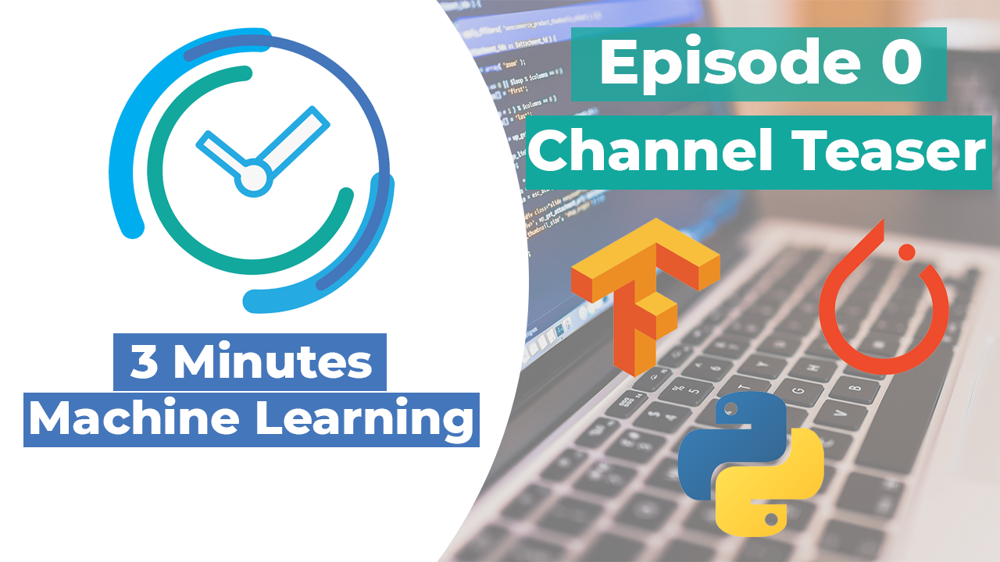

# TMML
## 3 Minutes Machine Learning
3 minutes machine learning is a series of tutorials and informative videos related to the world of machine learning. You can find the complete videos on YouTube. This repository contains all the files shown in the videos. This series is in experimental phase and is developed totally free of charge, for fun and culture! Any feedback is welcome. For doubts/questions or collaborate to the project contact me on GitHub/Youtube/LinkedIn.

